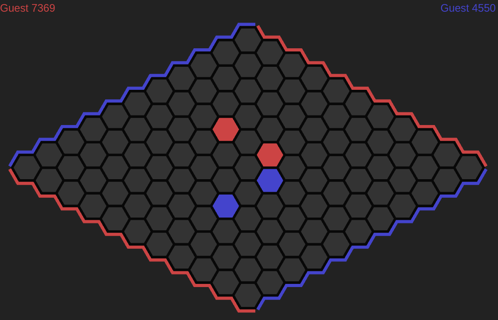

# Hex

Play Hex online.

Currently hosted here: <https://hex.alcalyn.app/>



## Features

This is a work in progress. Here is the unexhaustive list of implemented and planned features:

- [x] Play online multiplayer
- [x] Play vs an AI (Mohex)
- [x] Dark/light theme, mobile support
- [x] Multiple board sizes, from 1x1 to 25x25
- [x] Watch other games currently playing
- [ ] Swap rule
- [ ] Let AI review my game, bad moves, better moves...
- [ ] Chrono
- [ ] Translations to other languages
- [ ] Elo score, games history


## Install

```
yarn install
yarn dev
```

### Mohex AI

To enable Mohex and play with this challenging AI,
you need to download the library and build it from source.

Here is Mohex source code: <https://github.com/cgao3/benzene-vanilla-cmake>

``` bash
# Install dependencies
sudo apt update
sudo apt install libboost-all-dev build-essential libdb-dev build-essential cmake

# Download Mohex source code
git clone https://github.com/cgao3/benzene-vanilla-cmake
cd benzene-vanilla-cmake/

# Go back to an older version, I get a strange AI behaviour on latest version.
# See https://github.com/cgao3/benzene-vanilla-cmake/issues/14
git checkout f888938bc7ab051a04034a9e19a31399a31d2429

# Then follow the build steps, same as described in project readme
mkdir build
cd build/
cmake ../
make -j4
cd ../
```

You now have the binary at path `./build/src/mohex/mohex`.

Get the full path of this binary, and set it in your `.env` file, for example:

``` dotenv
MOHEX_BINARY=/home/debian/develop/benzene-vanilla-cmake/build/src/mohex/mohex
```


## License

This library is under [AGPL-3.0 license](LICENSE).
