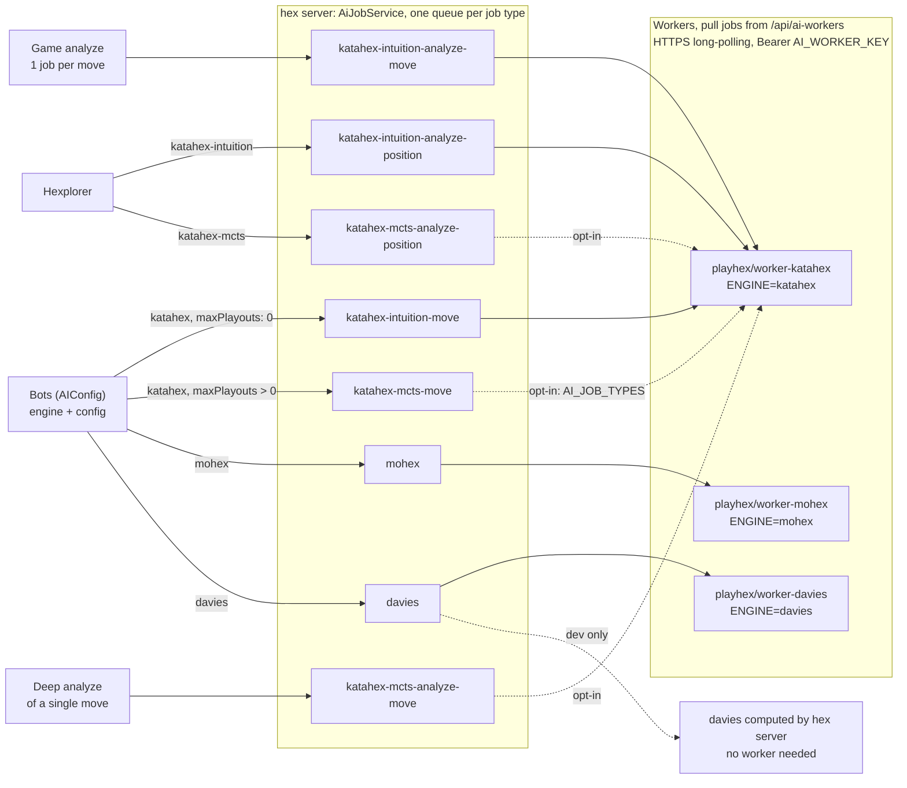
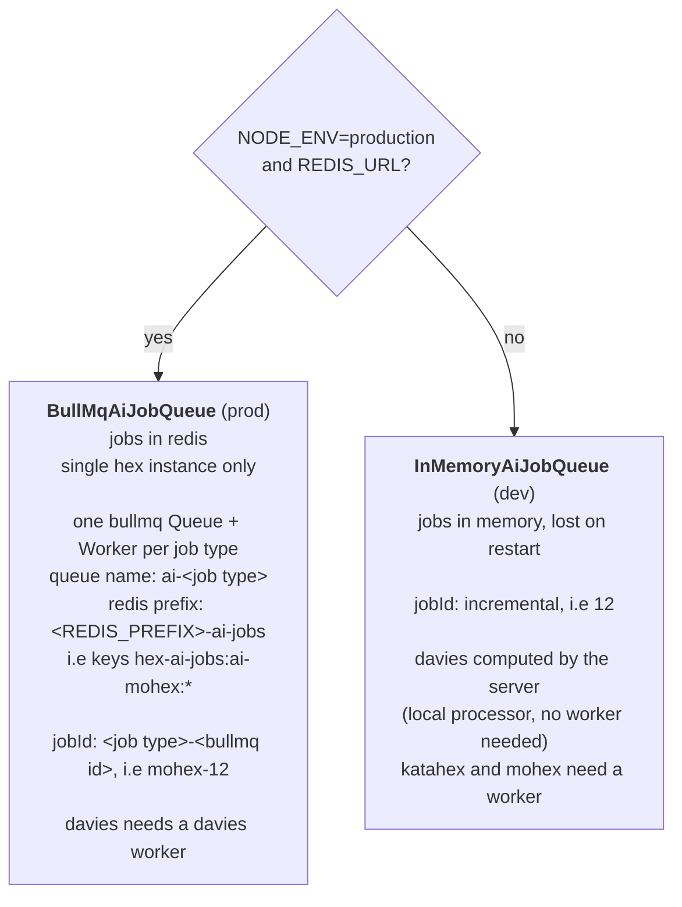
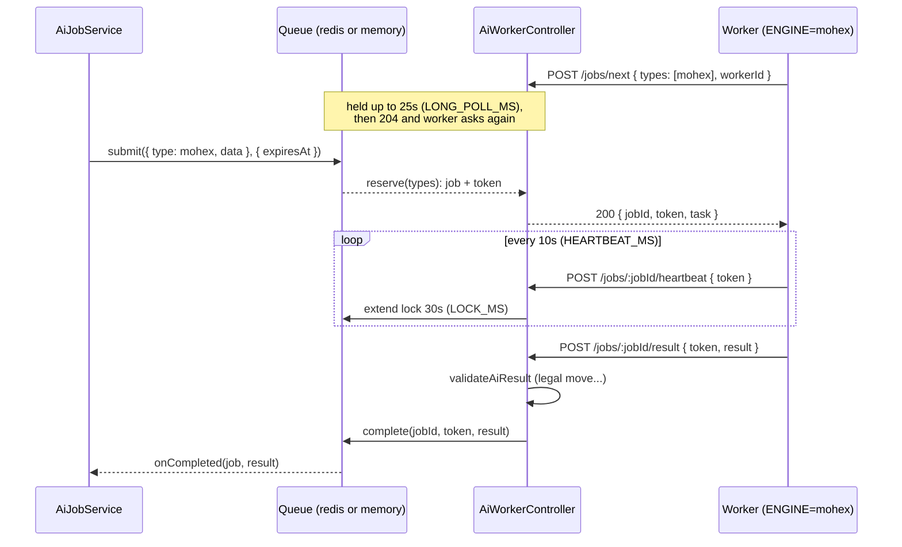
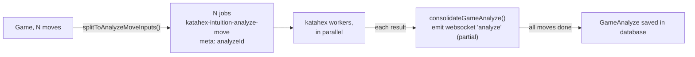
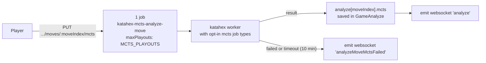

# AI jobs

How bot moves, game analyzes and Hexplorer positions are computed by AI workers.

Code: `src/server/ai-jobs/`, workers in [hex-ai-distributed](https://github.com/playhex/hex-ai-distributed).
Protocol and job types: `src/server/ai-jobs/protocol.ts` (copied in hex-ai-distributed `src/shared/protocol.ts`).

## Overview

## Names

| Bot (AIConfig)                    | Job type = queue                     | Task data                      | Worker engine | Docker image             |
|-----------------------------------|--------------------------------------|--------------------------------|---------------|--------------------------|
| `katahex`, `maxPlayouts: 0`       | `katahex-intuition-move`             | `KatahexMoveInput`             | `katahex`     | `playhex/worker-katahex` |
| `katahex`, `maxPlayouts: N > 0`   | `katahex-mcts-move`                  | `KatahexMctsMoveInput`         | `katahex`     | `playhex/worker-katahex` |
| `mohex`, `maxGames`               | `mohex`                              | `MohexMoveInput`               | `mohex`       | `playhex/worker-mohex`   |
| `davies`, `level`                 | `davies`                             | `DaviesMoveInput`              | `davies`      | `playhex/worker-davies`  |
| (Hexplorer, intuition)            | `katahex-intuition-analyze-position` | `AnalyzePositionInput`         | `katahex`     | `playhex/worker-katahex` |
| (Game analyze, one job per move)  | `katahex-intuition-analyze-move`     | `AnalyzeMoveInput`             | `katahex`     | `playhex/worker-katahex` |
| (Hexplorer, MCTS)                 | `katahex-mcts-analyze-position`      | `MctsAnalyzePositionInput`     | `katahex`     | `playhex/worker-katahex` |
| (Deep analyze of a single move)   | `katahex-mcts-analyze-move`          | `MctsAnalyzeMoveInput`         | `katahex`     | `playhex/worker-katahex` |
| `random`                          | none, computed by server             |                                |               |                          |

- **Engine**: AI program run by a worker (`ENGINES` in protocol). One worker process runs one engine.
- **Job type**: kind of task, and name of its queue (`AI_JOB_TYPES` in protocol). Determines the engine.
  Bot to job type: `getBotJobType()` in `botTasks.ts`.
- **Task**: `{ type: <job type>, data: <input> }`, what is sent to the worker.
- **Job**: a task in a queue, with a `jobId`, `meta` (i.e `analyzeId` for game analyzes) and `expiresAt`.
- **Worker**: a process pulling jobs. Identified by `workerId` (random uuid on start), authenticated by a key (`PlayerAiWorkerKey`).
  A key can be used by multiple workers. Processes default job types of its engine, or the ones listed in `AI_JOB_TYPES` env var.
- **Opt-in job types**: `katahex-mcts-*` (`OPT_IN_AI_JOB_TYPES` in protocol), require more computing power.
  Not processed by default, only by workers listing them in `AI_JOB_TYPES`.
  So katahex bots with `maxPlayouts > 0`, Hexplorer MCTS and deep analyzes are available only when such a worker is connected.
- **Playouts**: set by bots config (`maxPlayouts`) for bot moves,
  and by server (`MCTS_PLAYOUTS` in `src/shared/app/mctsSettings.ts`) for analyzes, clients cannot choose them.
  `MCTS_PLAYOUTS` is part of MCTS analyzes cache keys (`analysisCacheKey()`), so it can be changed between releases.

## Dev and prod

`createAiJobQueue()` in `AiJobService.ts` chooses the queue implementation:

In both cases, jobs waiting when server starts are removed (nobody waits their result anymore),
and game analyzes not finished are marked as errored.

bullmq `Worker` is not used to process jobs, only to reserve them with a token (`getNextJob`)
and to move back stalled jobs to waiting. Jobs are processed by remote workers.

## Job lifecycle

- **Priority**: a worker processing multiple job types gets jobs by `AI_JOB_TYPES` order
  (bot moves, then Hexplorer, then game analyzes and deep analyzes), then oldest first in a queue.
  A queue without any worker does not block other queues.
- **No heartbeat for 30s** (worker killed, laptop closed): job is given to another worker, up to 3 times, then fails.
  The old worker gets 409 and abandons the job.
- **fail with retryable** (engine crashed): job is given to another worker. **Not retryable** (unsupported task): job fails.
- **Expired** (`expiresAt`, i.e bot clock elapsed): job fails instead of being given to a worker.
- **401**: key invalid or revoked, worker stops.

Online workers are tracked in memory by `AiWorkersRegistry` (seen in the last 60s),
used to know which AIs are available (`/api/ai-configs-status`), and shown in `/api/admin/ai-workers`.

## Game analyze

Partial results are kept in memory only: if server restarts, the analyze is marked as errored and can be requested again.

Moves not taken by a worker within 1h fail (null in analyze).
10 minutes later, the analyze ends anyway with moves analyzed so far,
in case a move job is still waiting in queue with no worker left to take it.

## Deep analyze of a move

Once a game analyze has ended, a logged in player can request a deep analyze of any move
(`PUT /api/games/:publicId/analyze/moves/:moveIndex/mcts`, rate limited per player).

- Intuition analyze of the move is kept, deep analyze is added in `mcts`, and displayed instead of intuition.
- A move already deeply analyzed, or being analyzed, is not analyzed again (pending analyzes kept in memory by `GameAnalyzeController`).
- Results of a same game are saved one after the other, to not lose one when two finish at the same time.
